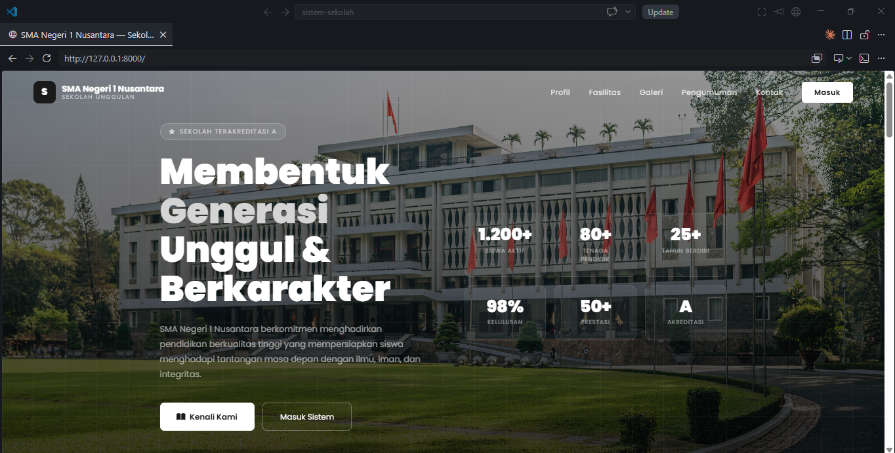
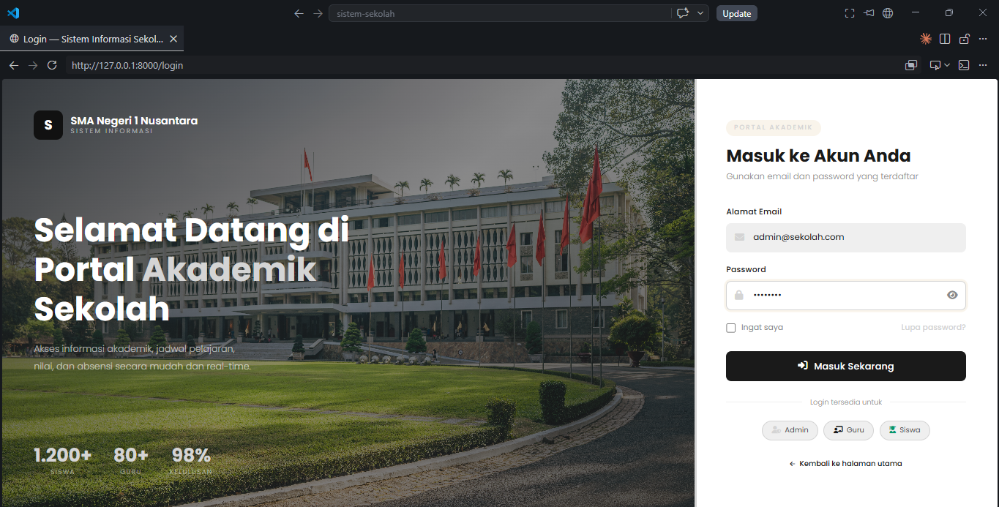
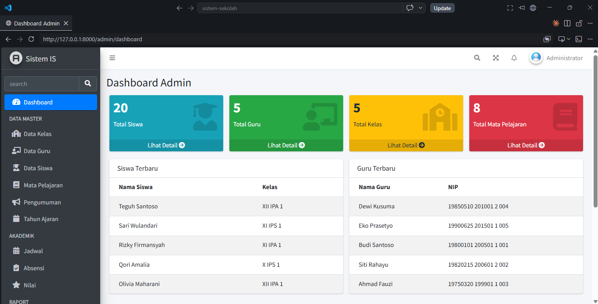
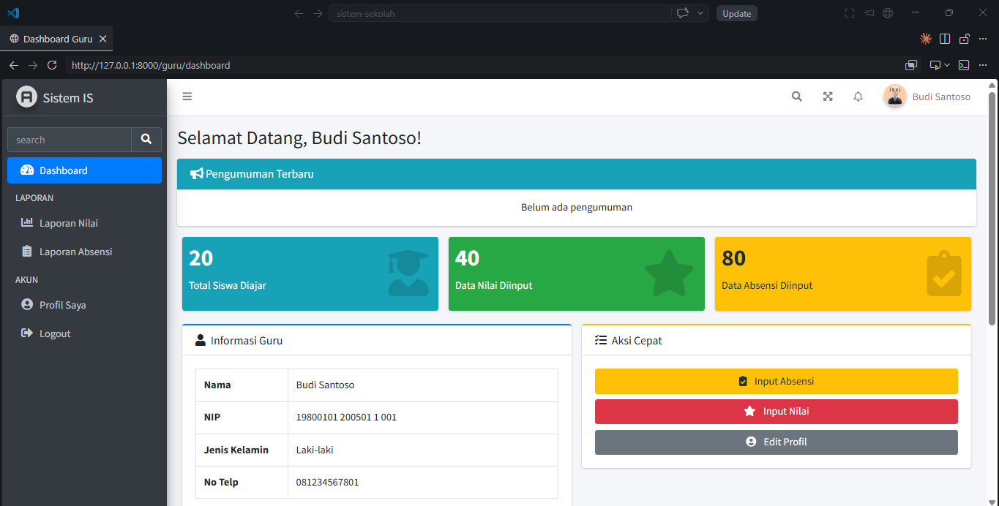
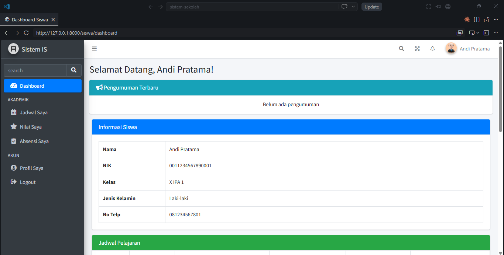

# Sistem Informasi Sekolah

> Aplikasi manajemen sekolah berbasis web yang modern, lengkap, dan mudah digunakan.


---

## Tentang Aplikasi

**Sistem Informasi Sekolah** adalah aplikasi manajemen sekolah berbasis web yang dibangun menggunakan **Laravel 12** dan **MySQL**. Aplikasi ini dirancang untuk membantu sekolah dalam mengelola data akademik secara digital, efisien, dan terintegrasi.

Cocok untuk:

- Sekolah Dasar (SD)
- Sekolah Menengah Pertama (SMP)
- Sekolah Menengah Atas (SMA/SMK)
- Yayasan Pendidikan

---

## Fitur Unggulan

### Admin

| Fitur            | Keterangan                              |
| ---------------- | --------------------------------------- |
| Dashboard        | Statistik siswa, guru, kelas, dan mapel |
| Manajemen Siswa  | CRUD data siswa lengkap                 |
| Manajemen Guru   | CRUD data guru lengkap                  |
| Manajemen Kelas  | Kelola data kelas                       |
| Mata Pelajaran   | Kelola data mata pelajaran              |
| Jadwal Pelajaran | Atur jadwal mengajar                    |
| Absensi          | Kelola data absensi siswa               |
| Nilai            | Input dan kelola nilai siswa            |
| Pengumuman       | Buat pengumuman untuk guru/siswa        |
| Cetak Raport     | Export raport siswa ke PDF              |
| Laporan          | Export laporan nilai & absensi ke PDF   |
| Backup Database  | Backup dan download database            |
| Profil           | Edit profil dan ganti password          |

### Guru

| Fitur         | Keterangan                        |
| ------------- | --------------------------------- |
| Dashboard     | Jadwal mengajar & statistik kelas |
| Input Absensi | Catat kehadiran siswa             |
| Input Nilai   | Input nilai tugas, UTS, UAS       |
| Pengumuman    | Lihat pengumuman dari admin       |
| Profil        | Edit profil dan ganti password    |

### Siswa

| Fitur            | Keterangan                         |
| ---------------- | ---------------------------------- |
| Dashboard        | Jadwal, absensi, dan nilai sendiri |
| Jadwal Pelajaran | Lihat jadwal kelas                 |
| Absensi          | Lihat rekap kehadiran              |
| Nilai            | Lihat nilai per mata pelajaran     |
| Pengumuman       | Lihat pengumuman sekolah           |
| Profil           | Edit profil dan ganti password     |

---

## Teknologi yang Digunakan

- **Backend**: Laravel 12 (PHP 8.2)
- **Database**: MySQL 8.0
- **Frontend**: AdminLTE 3 + Bootstrap 4
- **Authentication**: Laravel Breeze
- **PDF Export**: DomPDF (barryvdh/laravel-dompdf)
- **Backup**: Spatie Laravel Backup
- **DataTables**: jQuery DataTables
- **Alert**: SweetAlert2

---

## Persyaratan Sistem

- PHP >= 8.2
- Composer
- MySQL >= 8.0
- Node.js & NPM
- Laravel 12

---

## Cara Instalasi

### 1. Clone Repository

```bash
git clone https://github.com/Dikaramadhan/sistem-sekolah.git
cd sistem-sekolah
```

### 2. Install Dependencies

```bash
composer install
npm install
npm run build
```

### 3. Setup Environment

```bash
cp .env.example .env
php artisan key:generate
```

### 4. Konfigurasi Database

Edit file `.env`:

```env
DB_CONNECTION=mysql
DB_HOST=127.0.0.1
DB_PORT=3306
DB_DATABASE=db_sekolah
DB_USERNAME=root
DB_PASSWORD=
```

### 5. Migrasi Database

```bash
php artisan migrate
```

### 6. Storage Link

```bash
php artisan storage:link
```

### 7. Jalankan Aplikasi

```bash
php artisan serve
```

Akses di: `http://localhost:8000`

---

## Akun Default

Setelah instalasi, buat akun admin melalui halaman register lalu ubah role di database:

| Role  | Email              | Password |
| ----- | ------------------ | -------- |
| Admin | admin@sekolah.com  | password |
| Guru  | guru1@sekolah.com  | password |
| Siswa | siswa1@sekolah.com | password |

---

## Struktur Database

```
users           → Data akun login (semua role)
siswa           → Data detail siswa
guru            → Data detail guru
kelas           → Data kelas
mata_pelajaran  → Data mata pelajaran
jadwal          → Jadwal pelajaran
absensi         → Data kehadiran siswa
nilai           → Data nilai siswa
pengumuman      → Data pengumuman sekolah
```

---

## Screenshot

### Landing Page



### Halaman Login



### Dashboard Admin



### Dashboard Guru



### Dashboard Siswa



---

## Keamanan

- Role-Based Access Control (RBAC)
- Middleware proteksi per role
- CSRF Protection
- Password Hashing (bcrypt)
- Input Validation
- Rate Limiting Login

---

## Lisensi

Project ini dibuat untuk keperluan komersial. Hak cipta dilindungi.

© 2026 Dikaramadhan. All rights reserved.

---

## Kontak

Untuk informasi lebih lanjut, pembelian lisensi, atau kustomisasi:

- Email: [dhikaramadhan7@gmail.com]
- WhatsApp: [08998375434]
- GitHub: [Dikaramadhan](https://github.com/Dikaramadhan)

---

> Jika project ini bermanfaat, jangan lupa beri bintang di GitHub!
